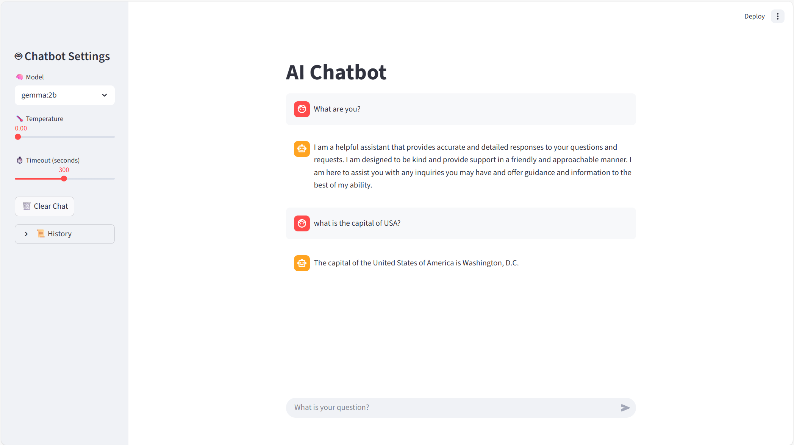

# 🤖 AI Ollama Chatbot

[](https://www.python.org/)
[](LICENSE)

Dive into the future of local AI conversations! This sleek Streamlit-powered chatbot harnesses the power of Ollama and LangChain to deliver lightning-fast, customizable chats with cutting-edge AI models—all running right on your machine. No cloud required—just pure, private intelligence at your fingertips!

## 📸 Demo

Check out this stunning screenshot of the chatbot in action:



Experience seamless interactions with adjustable settings, real-time history, and a user-friendly interface that makes AI feel like a friendly neighbor.

## 📋 Table of Contents

- [Features](#features)
- [Prerequisites](#prerequisites)
- [Installation](#installation)
- [Usage](#usage)
- [Configuration](#configuration)
- [Project Structure](#project-structure)
- [Future Enhancements](#future-enhancements)
- [Contributing](#contributing)
- [License](#license)
- [Support](#support)

## Features

- Interactive web-based chat interface using Streamlit
- Local AI chatbot powered by Ollama models
- Integration with LangChain for model management
- Model selection (e.g., gemma:2b, llama2:7b, mistral:7b)
- Adjustable parameters: temperature and timeout
- Conversation history display
- Clear chat functionality
- System prompt for helpful, accurate responses

## Prerequisites

- Python 3.10 or higher
- Ollama installed and running
- Git (for cloning the repository)

## Installation

Get up and running in minutes! Follow these steps to unleash your chatbot:

1. **Clone the repository:**
   ```bash
   git clone <your-repo-url>
   cd ai-ollama-chatbot
   ```

2. **Set up your virtual environment:**
   ```bash
   python -m venv .venv
   source .venv/bin/activate  # On Windows: .venv\Scripts\activate
   ```

3. **Install the goodies:**
   ```bash
   pip install -r requirements.txt
   ```

4. **Power up Ollama:**
   - Grab Ollama from [ollama.ai](https://ollama.ai) and install it.
   - Pull your favorite models (default options included):
     ```bash
     ollama pull gemma:2b
     ollama pull llama2:7b
     ollama pull mistral:7b
     ```
   - Fire up the Ollama service and watch the AI awaken!

## 🚀 Usage

Ready to chat? Here's how to launch your AI companion:

1. Make sure Ollama is running.
2. Activate your virtual environment.
3. Blast off with Streamlit:
   ```bash
   streamlit run app.py
   ```
4. Open the local URL in your browser and start conversing—ask anything!

## Configuration

Tweak the chatbot to fit your style with these sidebar controls:

- **Model Selection:** Pick from Gemma, Llama, Mistral, or add your own.
- **Temperature:** Slide from 0.0 (precise) to 1.0 (creative) for the perfect vibe.
- **Timeout:** Set response waits from 10 to 600 seconds.
- **Clear Chat:** Hit reset to wipe the slate clean.
- **History:** Expand the sidebar to relive past chats.

## Project Structure

```
ai-ollama-chatbot/
├── app.py               # The heart of the chatbot—Streamlit magic happens here
├── requirements.txt     # All the Python potions you need
├── README.md            # You're reading it! (This guide to awesomeness)
├── pics/
│   └── 01.png           # A glimpse of the chatbot's charm
└── .venv/               # Your cozy virtual environment (keep it local)
```

## Future Enhancements

The sky's the limit! We're dreaming big for what's next:

- Support for additional Ollama models
- Persistent conversation history
- User authentication and multi-user support
- Custom system prompts
- Integration with other AI services
- Model fine-tuning options
- Mobile-responsive UI improvements

## Contributing

Love this project? Join the fun!

1. Fork the repo and branch out.
2. Code your heart out and make it shine.
3. Pull request your brilliance—let's build together!

## License

This project is open-source magic under the MIT License. Check the license file for the full spell.

## 💬 Support

Stuck in a pickle? We've got your back:

- Dive into [Ollama Docs](https://ollama.ai) for model wisdom.
- Explore [LangChain](https://python.langchain.com/) and [Streamlit](https://streamlit.io/) guides.
- Open an issue here—community power to the rescue!

